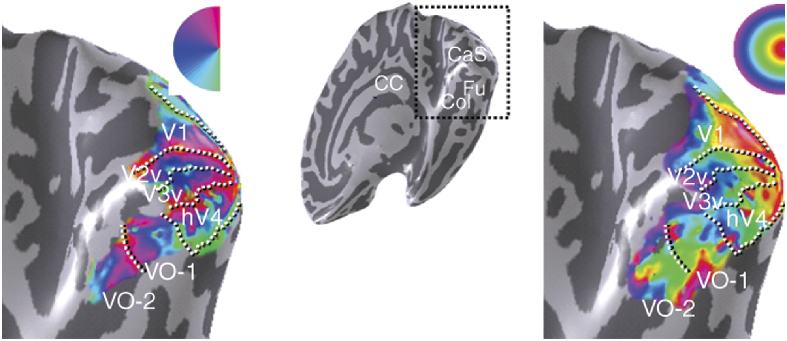
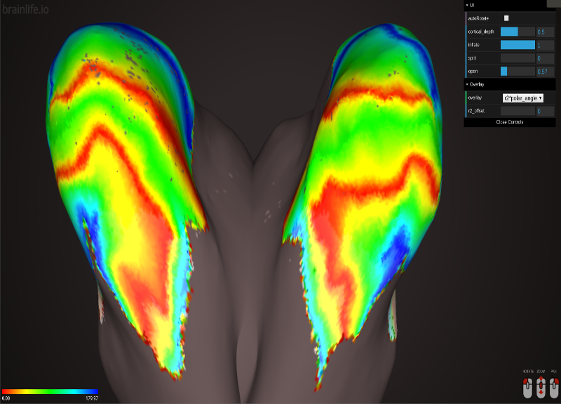

[](https://github.com/brain-life/abcd-spec)

# app-bayesian-retinotopy

This app computes retinotopic maps on visual cortex surface using both measured retinotopic data and an anatomical prior, following [Benson & Winawer 2018](https://elifesciences.org/articles/40224) and using Noah Benson's [neuropythy library](github.com/noahbenson/neuropythy).


Because retinotopic maps in human visual cortex are expected to be spatially smooth, fitting maps using voxel-wise measurements alone introduces noise into the outputted pRF parameters that can be at least partially regressed out by considering each voxel within the context of the entire visual field and the corresponding cortex. Retinotopic maps have been shown to be well predicted by gyral and sulcal topology, and so a group-derived algebraic template can be fit to a subject's anatomy and used as a prior when fitting fMRI measurements. By using both measured, voxel-wise fMRI data collected during a retinotopic task and an anatomical atlas as a prior, the retinotopic maps derived are more accurate than those derived from either data alone or anatomy alone [Benson et al, 2018](10.7554/eLife.40224).

pRF measures include:
  polar angle: the location of the receptive field in polar coordinates (from the upper vertical meridian at 0° to the lower vertical meridian at 180°)
  eccentricity: the deviation of the center of the receptive field from the fovea (in degrees)
  receptive field width: the size of the voxel's receptive field (the standard deviation of the receptive field's 2d isotropic Gaussian)
  visual area: the voxel's predicted visual area (1-12, key found in ./varea/key.txt)


Shows maps in several visual areas of polar angle, left, and eccentricity, right


Visualized on Brainlife

### Authors
- [David Hunt](davhunt@iu.edu)
- [Noah Benson](nben@nyu.edu)

### Project director
- Franco Pestilli (franpest@indiana.edu)

## Running the App 

### On Brainlife.io

You can submit this App online at [https://doi.org/10.25663/brainlife.app.245](https://doi.org/10.25663/brainlife.app.245) via the "Execute" tab.

### Running Locally (on your machine)

1. git clone this repo.
2. Inside the cloned directory, create `config.json` with something like the following content with path to your freesurfer subject directory.

```json
{
        "prf_surfs": "./prf/prf_surfaces"
        "freesurfer": "./freesurfer/subjects/bert"
}
```

3. Launch the App by executing `main`

```bash
./main
```

### Sample Datasets

If you don't have your own freesurfer and prf data, you can download sample datasets from Brainlife.io, or you can use [Brainlife CLI](https://github.com/brain-life/cli).

```
npm install -g brainlife
bl login
mkdir input
bl dataset download 598a2aa44258600aa3128fd4 && mv -R 598a2aa44258600aa3128fd4 input/output
bl dataset download 5daf6a1455718d57f377472b && mv -R 5daf6a1455718d57f377472b input/prf
```

## Output

All output files will be generated under the current working directory (pwd). The main output of this App is the directory `prf`, which contains the population receptive field measures polarAngle, eccentricity, rfWidth, and varea in the brain volume (*.nii.gz) as well as on the cortical surface (lh.polarAngle, etc) in freesurfer .curv format and gifti format.

```
    .
    ├── prf                     # Contains all pRF measures
    │   ├── polarAngle.nii.gz
    │   ├── eccentricity.nii.gz
    │   ├── rfWidth.nii.gz
    │   ├── varea.nii.gz
    │   ├── surfaces            # White, pial, inflated, and sphere surfaces in .vtk
    │   │   ├── lh.white.vtk
    │   │   ├── rh.white.vtk
    │   │   ├── ...
    │   ├── prf_surfaces        # pRF measures projected onto .vtk surfaces
    │   │   ├── lh.polarAngle
    │   │   ├── rh.polarAngle
    │   │   ├── ...
    ├── varea                   # Volumetric parcellation of brain into visual areas
    │   ├── key.txt
    │   ├── label.json
    │   ├── parc.nii.gz
    ├── varea_surf              # Surface/cortical parcellation into visual areas
    │   ├── key.txt
    │   ├── label.json
    │   ├── lh.parc.annot.gii
    └   └── rh.parc.annot.gii
```

### Dependencies

This App only requires [singularity](https://www.sylabs.io/singularity/) to run.

### References
[Benson et al, 2012. The retinotopic organization of striate cortex is well predicted by surface topology](https://doi.org/10.1016/j.cub.2012.09.014)

[Benson et al, 2014. Correction of distortion in flattened representations of the cortical surface allows prediction of V1-V3 functional organization from anatomy](10.1371/journal.pcbi.1003538)

[Benson et al, 2018. Bayesian analysis of retinotopic maps](10.7554/eLife.40224)
